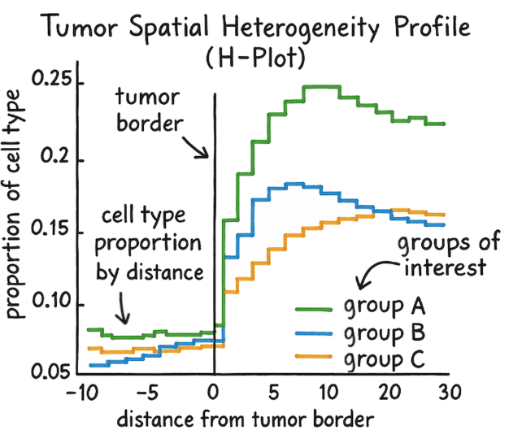

# hplot

**H-Plot: A spatial heterogeneity visualization for tissue-based distance layers**



`hplot` is a Python package for visualizing the spatial distribution of cell-type proportions across concentric distance layers measured from a tissue boundary (e.g., a tumor border). The H-Plot was introduced by Huang et al. as a Kaplan-Meier-inspired visualization that replaces time with spatial layer index on the x-axis, making it easy to see how cell composition changes as you move inward or outward across a tissue region.

One or more **target** proportions (e.g., immune cells, epithelial cells) can be plotted simultaneously, each as a separate line with per-layer confidence intervals derived from across-case variability.

---

## Installation

```bash
pip install -e .
```

**Dependencies:** `pandas`, `numpy`, `scipy`, `matplotlib`

---

## Input Data Format

The input is a CSV file where each row represents one tissue region (case) at one spatial layer.

| case_id | layer | target_prop | base_prop | subtype | distance |
|---------|-------|-------------|-----------|---------|----------|
| C1      | -2    | 0.05        | 0.40      | hot     | 210.3    |
| C1      | -1    | 0.08        | 0.38      | hot     | 105.1    |
| C1      |  0    | 0.15        | 0.35      | hot     | 0.0      |
| C1      |  1    | 0.20        | 0.30      | hot     | 98.7     |
| C2      | -1    | 0.03        | 0.50      | cold    | 112.0    |
| ...     | ...   | ...         | ...       | ...     | ...      |

### Column descriptions

| Column | Required | Description |
|--------|----------|-------------|
| `layer` | Yes | Integer layer index. `0` = tissue boundary; negative = outside; positive = inside. |
| `target_prop` | Yes | Proportion of the target cell type (e.g., immune cells) in that layer for that case. |
| `base_prop` | No | Proportion of an additional cell type (e.g., epithelial cells) to overlay for reference. Pass as a second entry in `targets`. |
| `case_id` / `group` | No | Groups rows into separate H-Plot lines (e.g., tumor subtype). |
| `distance` | No | Mean physical distance (in µm or other unit) corresponding to each layer index. Used for secondary x-axis tick labels. |

---

## Python API

### Basic usage

```python
import pandas as pd
from hplot.core import HPlot

df = pd.read_csv("input.csv")

hplot = HPlot()
hplot.fit(
    df,
    targets=["target_prop", "base_prop"],  # one line per column; use a string for a single target
    layer="layer",
    group="subtype",          # optional: draw one line per group value
    distance="distance",      # optional: physical distances for tick labels
    unit="µm",                # optional: unit shown on x-axis
    ci=0.95,                  # confidence interval level (default 0.95)
)
hplot.savefig("hplot_case.svg", format="svg")
```

### Plotting to an existing axis

```python
import matplotlib.pyplot as plt

fig, ax = plt.subplots(figsize=(8, 5))
hplot.plot(
    ci_show=True,
    ax=ax,
    display_base_type="tumor",        # shown in axis labels and title
    display_target_type="lymphocytes",
)
plt.tight_layout()
plt.savefig("hplot.png", dpi=300)
```

### `HPlot.fit()` parameters

| Parameter | Type | Default | Description |
|-----------|------|---------|-------------|
| `df` | `pd.DataFrame` | — | Input data frame. |
| `targets` | `str \| list[str]` | — | Column name(s) for cell proportions. Each column becomes a separate line on the plot. |
| `layer` | `str` | — | Column for the layer index. |
| `group` | `str \| None` | `None` | Column to split into separate lines (e.g. tumor subtype). |
| `distance` | `str \| None` | `None` | Column for mean physical distance per layer. |
| `unit` | `str \| None` | `None` | Unit label shown on the x-axis (e.g. `"µm"`). |
| `ci` | `float` | `0.95` | Confidence level. Uses t-distribution for n ≤ 30, z-distribution for n > 30. |
| `color_map` | `dict \| None` | `None` | Explicit `{label: color}` mapping. Overrides `palette`. |
| `palette` | `sequence \| None` | `None` | Color sequence. Defaults to `plt.cm.tab10.colors`. |
| `legend_order` | `list \| None` | `None` | Order of legend entries. |
| `legend_title` | `str \| None` | `None` | Title for the legend box. |
| `legend_kwargs` | `dict \| None` | `None` | Extra kwargs forwarded to `ax.legend()`. |

### `HPlot.plot()` parameters

| Parameter | Type | Default | Description |
|-----------|------|---------|-------------|
| `ci_show` | `bool` | `True` | Whether to draw shaded confidence interval bands. |
| `ax` | `Axes \| None` | `None` | Existing matplotlib axis to draw into. Creates a new figure if `None`. |
| `display_base_type` | `str` | `"tumor"` | Name of the reference tissue type (used in title, x-axis label). |
| `display_target_type` | `str` | `"immune cells"` | Name of the target quantity, interpolated into the y-axis label. |
| `value_kind` | `str` | `"proportion"` | Kind of quantity on the y-axis, selecting the label phrasing: `"proportion"` → *Proportion of {target}* (cell-type fraction); `"fraction"` → *Fraction of cells in {target}* (niche / CME); `"expression"` → *Mean expression of {target}* (gene/signature). Ignored when `ylabel` is given. |
| `ylabel` | `str \| None` | `None` | Explicit y-axis label. Overrides the `value_kind` template entirely. |

### Y-axis label semantics

The H-Plot y-value is always a per-layer summary, but its meaning depends on what
you are plotting, so the label adapts via `value_kind`:

```python
# Cell-type proportion (default)
hplot.plot(display_target_type="lymphocytes")                       # "Proportion of lymphocytes"
# Niche / CME fraction
hplot.plot(display_target_type="cme_7 (tumor-core)", value_kind="fraction")  # "Fraction of cells in cme_7 (tumor-core)"
# Gene / signature mean expression
hplot.plot(display_target_type="CD8A", value_kind="expression")    # "Mean expression of CD8A"
# Full override
hplot.plot(ylabel="Mean CD8A expression (a.u.)")
```

An unknown `value_kind` raises `ValueError`; pass `ylabel` for anything outside
the three templates.

---

## Per-layer p-value track

For a **two-group** comparison of a single target, `hplot` can overlay a per-layer
p-value as a dashed line on a secondary log y-axis (small p near the bottom). At
each layer the per-case target values of the two groups are compared with a
statistical test (Mann-Whitney U by default).

```python
hplot = HPlot()
hplot.fit(
    df,
    targets="target_prop",     # single target only when pvalue=True
    layer="layer",
    group="subtype",           # the two arms to compare
    distance="distance",
    unit="µm",
    pvalue=True,               # compute the per-layer p-value table
    pvalue_test="mannwhitney", # "mannwhitney" | "ttest" | "welch"
    pvalue_correction=None,    # None | "bonferroni" | "fdr_bh"
)
ax = hplot.plot(
    display_base_type="tumor",
    display_target_type="immune cells",
    pvalue_show=True,          # draw the dashed p-value line + right log axis
)
ax.get_figure().savefig("hplot_pvalue.png", dpi=300, bbox_inches="tight")
```

You can also call the underlying statistics directly:

```python
from hplot import compute_layer_pvalues

pvals = compute_layer_pvalues(
    df, prop="target_prop", layer_col="layer", group_col="subtype",
    groups=("hot", "cold"),   # required if more than two groups exist
    test="mannwhitney", distance_col="distance", min_n=3, correction="fdr_bh",
)
# columns: layer, distance, p_value, stat, n1, n2, p_adj
```

### p-value parameters

| Parameter | Where | Default | Description |
|-----------|-------|---------|-------------|
| `pvalue` | `fit` | `False` | Compute the per-layer p-value table. Requires `group` and a single target. |
| `pvalue_test` | `fit` | `"mannwhitney"` | Test per layer: `"mannwhitney"`, `"ttest"`, or `"welch"`. |
| `pvalue_groups` | `fit` | `None` | Explicit `(group_a, group_b)` pair. Required when `group` has more than two values. |
| `pvalue_correction` | `fit` | `None` | Multiple-testing correction across layers: `None`, `"bonferroni"`, `"fdr_bh"`. |
| `pvalue_min_n` | `fit` | `3` | Minimum cases per group for a layer to be tested; otherwise `p_value` is `NaN`. |
| `pvalue_show` | `plot` | `False` | Draw the dashed p-value line on a secondary log axis. |
| `pvalue_label` | `plot` | auto | Axis/legend label; defaults to `"p-value (<test>)"`. |
| `pvalue_color` | `plot` | `"black"` | Colour of the p-value line and threshold. |
| `pvalue_threshold` | `plot` | `0.05` | Significance level drawn as a reference line. |
| `pvalue_threshold_show` | `plot` | `True` | Whether to draw the threshold reference line. |
| `pvalue_use_adjusted` | `plot` | `False` | Plot the corrected `p_adj` column instead of `p_value`. |


## Batch CLI

```bash
python run_hplot.py \
  --input input.csv \
  --targets target_prop base_prop \
  --layer layer \
  --group subtype \
  --distance distance \
  --unit µm \
  --output hplots \
  --prefix case \
  --format svg \
  --dpi 300 \
  --ci
```

The CLI reads the CSV, groups by `--group` (if provided), and saves one H-Plot file per group into `--output`.

### CLI arguments

| Argument | Short | Default | Description |
|----------|-------|---------|-------------|
| `--input` | `-i` | *(required)* | Path to input CSV file. |
| `--targets` | | `target_prop` | One or more column names for cell proportions (each becomes a separate line). |
| `--layer` | | `layer` | Column for the layer index. |
| `--group` | | `None` | Column to split into separate output files. |
| `--distance` | | `None` | Column for physical distance per layer. |
| `--unit` | `-u` | `None` | Physical distance unit label (e.g. `µm`). |
| `--output` | `-o` | `hplots` | Directory for output files. |
| `--prefix` | `-p` | `hplot` | Prefix for output filenames. |
| `--format` | `-f` | `svg` | Output format: `svg`, `pdf`, or `png`. |
| `--dpi` | | `300` | DPI for raster output (PNG). |
| `--ci` | | flag | Show confidence interval bands. |

---

## Batch Python API

```python
from hplot.runners import run_hplot_batch

run_hplot_batch(
    df=df,
    targets=["target_prop", "base_prop"],  # one or more column names
    layer="layer",
    group="subtype",          # optional
    distance="distance",      # optional
    unit="µm",                # optional
    ci=0.95,
    output="hplots",
    prefix="case",
    ci_show=True,
    format="svg",
    dpi=300,
)
```

### `run_hplot_batch()` parameters

| Parameter | Type | Default | Description |
|-----------|------|---------|-------------|
| `df` | `pd.DataFrame` | — | Input data frame. |
| `targets` | `str \| list[str]` | `"target_prop"` | Column name(s) for cell proportions. |
| `layer` | `str` | `"layer"` | Column for the layer index. |
| `group` | `str \| None` | `None` | Column to split into separate output files. |
| `distance` | `str \| None` | `None` | Column for physical distance per layer. |
| `unit` | `str \| None` | `None` | Physical distance unit label. |
| `ci` | `float` | `0.95` | Confidence level. |
| `output` | `str` | `"hplots"` | Directory for output files (created if absent). |
| `prefix` | `str` | `"hplot"` | Prefix for output filenames. |
| `ci_show` | `bool` | `True` | Whether to draw confidence interval bands. |
| `format` | `str` | `"svg"` | Output format: `"svg"`, `"pdf"`, or `"png"`. |
| `dpi` | `int` | `300` | DPI for raster output (PNG). |

---

## How confidence intervals are computed

For each layer, `hplot` aggregates the proportion values across all cases in a group and computes:

- **Mean** proportion across cases
- **Standard error of the mean** (SEM)
- **CI bounds** using:
  - t-distribution (two-tailed) when n ≤ 30
  - z-distribution when n > 30

When a layer contains only a single case (n = 1), CI bounds equal the mean (no interval shown).

---

## Project structure

```
hplot/
  core.py      — HPlot class (fit / plot / savefig)
  plotting.py  — plot_hplot() rendering function
  stats.py     — compute_layer_stats() per-layer CI computation
  runners.py   — run_hplot_batch() batch helper
  cli.py       — argparse CLI entry point
run_hplot.py   — convenience script entry point
```

---

## Citation

If you use WSInsight or H-Plot in your research, please cite the following:

- **WSInsight** — Huang, C.-H. et al. *npj Precision Oncology* (2025). [https://www.nature.com/articles/s41698-025-00841-9](https://www.nature.com/articles/s41698-025-00841-9)
- **H-Plot** — Huang, C.-H. et al. *bioRxiv* (2025). [https://www.biorxiv.org/content/10.1101/2025.12.07.692260v1](https://www.biorxiv.org/content/10.1101/2025.12.07.692260v1)

BibTeX:

```bibtex
@article{wsinsight2025,
  title   = {Integrative whole slide image and spatial transcriptomics analysis with QuST and QuPath},
  author  = {Huang, Chao-Hui and others},
  journal = {npj Precision Oncology},
  year    = {2025},
  doi     = {10.1038/s41698-025-00841-9},
  url     = {https://www.nature.com/articles/s41698-025-00841-9}
}

@article{hplot2025,
  title   = {WSInsight as a cloud-native pipeline for single-cell pathology inference on whole-slide images},
  author  = {Huang, Chao-Hui and others},
  journal = {bioRxiv},
  year    = {2025},
  doi     = {10.1101/2025.12.07.692260},
  url     = {https://www.biorxiv.org/content/10.1101/2025.12.07.692260v1}
}
```

## License

Apache License 2.0 — see [LICENSE](LICENSE) for details.
