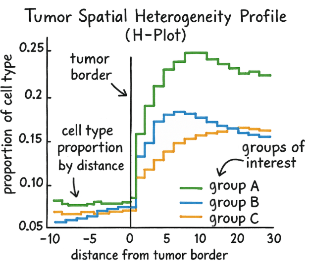

# hplot

**H-Plot: A graph-geodesic framework for distance-stratified spatial profiling
at tissue boundaries**



`hplot` converts per-cell spatial transcriptomics or digital-pathology data into
a Kaplan–Meier-style curve family that shows how tissue composition changes with
signed distance from a tissue boundary (e.g. the tumour–stroma interface).

The analysis is structured in **three stages** with increasing specificity:

| Stage | What | Function / CLI |
|-------|------|----------------|
| 0 | Per-layer mean ± CI curve | `HPlot.fit()` / `hplot plot` |
| 1 | Cluster-mass permutation test — which layer window is significant? | `compute_layer_pvalues()` / `hplot test --permutations` |
| 2 | H-Plot–GAM effect size (smooth per-group curves + ΔH-Plot–GAM difference) — how large is the effect, and is it a demographic confound? | `gam_group_curves()`, `gam_delta_curve()`, `gam_pooled_effect()` / `hplot gam` |

---

## Installation

```bash
pip install -e .
```

**Hard dependencies:** `pandas`, `numpy`, `scipy`, `matplotlib`, **`pygam`**

```bash
# Docker (for paper reproducibility — no local Python setup needed)
docker build -t hplot .
docker run --rm -v "$PWD":/data hplot test -i /data/data.csv \
    --target immune_fraction --group hpv_status --permutations 999
```

---

## Conceptual background

### Graph-geodesic layer definition

Each cell in a tissue is assigned a signed integer *layer index* l ∈ ℤ based on
the shortest graph-geodesic path to the boundary of interest:

- **l = 0**: cells at the boundary itself (e.g. first tumour-adjacent layer)
- **l > 0**: cells *inside* the tumour, in ascending hops
- **l < 0**: cells *outside* the tumour (stromal side)

Within a layer, the fraction of a target cell type is averaged across all cells
belonging to that patient/slide.  Stacking these per-patient fractions across a
cohort and computing the mean ± CI at each layer produces the H-Plot curve.

### Stage 0 — per-layer mean ± CI

For each group g and layer l, the aggregated fraction y_{ig,l} over patients
i = 1..n_{g,l} is summarised as:

- **Mean**: μ_{g,l} = (1/n) Σ_i y_{il}
- **Standard error**: SE_{g,l} = s_{g,l} / √n
- **CI bounds**: μ ± t_{α/2, n-1} · SE (t-distribution for n ≤ 30,
  z-distribution for n > 30)

---

## Stage 1 — Cluster-mass permutation test

### Motivation

A naïve approach would apply a Mann-Whitney U test at each layer and correct for
multiple testing with Bonferroni or FDR.  But spatial biology is *autocorrelated*
along the layer axis: if layer 3 is significantly enriched for immune cells,
layers 2 and 4 usually are too.  Correcting independently ignores this structure
and loses power.

The cluster-mass (or "cluster-forming") test accounts for spatial autocorrelation
by treating a *contiguous run* of significant layers as the test statistic.

### Algorithm

**Per-layer test statistic**

At each layer l with at least `min_n` cases per group, compute the Mann-Whitney U
rank sum:

```
W_l = U(y_{1,l}, y_{2,l})
```

The p-value p_l is derived from the asymptotic normal approximation of U.

**Cluster-mass statistic T_obs**

A layer is "cluster-forming" if p_l < α_cluster (default 0.05).  Maximal runs of
consecutive cluster-forming layers are identified.  The cluster-mass of a run
[l_start, l_end] is:

```
T = Σ_{l=l_start}^{l_end}  (α_cluster - p_l)
```

(Equivalently, the sum of "excess significance" over the cluster.)  Runs shorter
than `band_min_width` are discarded as noise spikes.

**Permutation null distribution**

Under H₀ (no spatial group difference), group labels are permuted n_perm times.
For each permutation the whole per-layer testing + cluster-mass computation is
repeated, yielding T_{null}^{(b)}, b = 1..n_perm.

**Permutation p-value**

```
p_perm = #{b : T_{null}^{(b)} >= T_obs} / n_perm
```

A conventional threshold of p_perm < 0.05 is used.  Because the null is
constructed empirically, no parametric assumption about the T distribution is
needed.

### Usage

```python
from hplot.stats import compute_layer_pvalues

pvals = compute_layer_pvalues(
    df,
    prop="immune_fraction",
    layer_col="layer",
    group_col="hpv_status",
    groups=("HPV-", "HPV+"),   # (low, high) — order matters for effect sign
    test="mannwhitney",
    correction="fdr_bh",       # optional FDR correction across layers
    min_n=3,
)
# columns: layer, distance, p_value, p_adj, stat, n1, n2
```

CLI:

```bash
hplot test -i data.csv --target immune_fraction --group hpv_status \
    --groups "HPV-" "HPV+" --permutations 999 --correction fdr_bh \
    -o pvalues.csv
```

---

## Stage 2 — GAM effect size and confounder adjustment

### Why GAM after Stage 1?

Stage 1 answers **"is there a significant spatial difference?"** but not:

- **How large is it?** (Mann-Whitney U gives a rank-based test statistic, not
  an effect size in natural units)
- **Is it caused by demographic differences?** (e.g. HPV+ patients are younger
  — is the immune enrichment actually driven by age, not HPV status?)

A Generalised Additive Model (GAM) fits a smooth non-parametric curve over the
whole layer range and provides an interpretable marginal effect size, with or
without adjusting for confounders.

### Mathematical model

The pooled model is:

```
y_{il} = f(l) + β_g · g_i + Σ_k β_k · x_{ik} + ε_{il}
```

where:

- `y_{il}` is the target fraction for patient i at layer l
- `f(l) = B(l)^T α` is a penalised B-spline smooth:
  - **B(l)** is the K-dimensional B-spline basis at layer l (K = n_splines = 10 by default)
  - **α** are the spline coefficients estimated by penalised least squares
- `β_g` is the linear group effect (g_i ∈ {0, 1})
- `β_k` are linear effects of optional confounders x_{ik}
  (z-scored internally: μ=0, σ=1)
- `ε_{il} ~ N(0, σ²)` is residual error

### Penalised estimation

The spline coefficients are estimated by:

```
α* = argmin_α  ||y - B α||² + λ · ||D² α||²
```

where **D²** is the second-difference matrix that penalises curvature, and λ is
the smoothing parameter.

### Smoothing parameter selection (GCV)

λ is chosen by Generalised Cross-Validation (GCV):

```
λ* = argmin_λ  RSS(λ) / [n · (1 - trace(H_λ)/n)]²
```

where H_λ = B (B^T B + λ D^T D)^{-1} B^T is the hat matrix.  GCV avoids
over-smoothing (underfitting biology) and under-smoothing (fitting noise).

### Effect size

The high-minus-low group effect at layer l₀ (the Stage-1 peak) is:

```
Δ = f̂(l₀, g=1, x=x̄) - f̂(l₀, g=0, x=x̄)
```

Covariates are evaluated at their mean (0 after z-scoring), so Δ is the marginal
group contrast at a "typical" patient.  If Δ is essentially the same with and
without covariate adjustment, the Stage-1 signal is not a demographic confound.

### Confidence intervals (per-group curves)

`gam_group_curves()` fits separate `target ~ s(layer)` models per group and
returns 95 % pointwise CIs:

```
CI(l) = f̂(l) ± 1.96 · SE_f̂(l)
```

where `SE_f̂(l) = sqrt[B(l)^T (B^T B + λ D^T D)^{-1} B(l) · σ̂²]`.

### Differential curve — ΔH-Plot–GAM

The per-group smooths from `gam_group_curves()` are the **H-Plot–GAM** view
(one penalised curve per group, drawn on top of the raw layer means). Their
layer-wise difference is the **differential H-Plot–GAM** (ΔH-Plot–GAM):

```
Δ(l) = f̂_high(l) − f̂_low(l)
```

`gam_delta_curve()` computes this together with a CI propagated in quadrature
(Gaussian error propagation, assuming the two group models are independent):

```
σ_Δ(l) = sqrt[ σ_high(l)² + σ_low(l)² ]      CI(l) = Δ(l) ± σ_Δ(l)
```

and two pointwise significance masks: `sig_pos` where the CI excludes 0 from
below (high group larger) and `sig_neg` where it excludes 0 from above (low
group larger).

> **Pointwise, not corrected.** `sig_pos` / `sig_neg` reflect layer-by-layer CI
> exclusion of zero and are **not** corrected for multiple comparisons across
> layers. Use the ΔH-Plot–GAM colouring for visualisation and localisation
> only; use the Stage-1 cluster-mass permutation test (with FDR) for
> confirmatory inference.

### Stage-1 double-dipping guard

**Always pass the full layer range to GAM functions.**  Fitting the GAM only on
layers selected by Stage 1 (the cluster-mass band) constitutes double-dipping:
the outcome and the analysis window are no longer independent, inflating the
apparent effect.  The correct workflow is:

1. Stage 1 identifies *which* layers are significant (whole-range test).
2. Stage 2 fits the model on the *whole* range and only *reads* the effect at
   the Stage-1 peak layer.

### Python API

```python
from hplot.stats import gam_group_curves, gam_pooled_effect, gam_delta_curve
import numpy as np

grid = np.arange(df["layer"].min(), df["layer"].max() + 1)

# Per-group smooth curves — the H-Plot–GAM view (for plotting)
curves = gam_group_curves(
    long_df=df,
    target_col="immune_fraction",
    layer_col="layer",
    group_col="hpv_status",
    grid=grid,
    groups=("HPV-", "HPV+"),
)
# curves["HPV+"] -> (pred_array shape=(G,), ci_array shape=(G,2))

# Difference curve — the ΔH-Plot–GAM view
diff, ci_lo, ci_hi, sig_pos, sig_neg = gam_delta_curve(
    curves, groups=("HPV-", "HPV+"),   # (low, high) -> Δ = high − low
)

# Pooled effect at the tumour border (layer 0), unadjusted
effect, pval, n = gam_pooled_effect(
    long_df=df, target_col="immune_fraction", layer_col="layer",
    group_col="hpv_status", at_layer=0,
    groups=("HPV-", "HPV+"),
)

# Confounder-adjusted (age, clinical stage, sex)
effect_adj, pval_adj, n_adj = gam_pooled_effect(
    long_df=df, target_col="immune_fraction", layer_col="layer",
    group_col="hpv_status", at_layer=0,
    groups=("HPV-", "HPV+"),
    covariate_cols=["AGE", "late_stage", "is_female"],
)

print(f"Unadjusted : Δ={effect:+.3f}  p={pval:.2e}  n={n}")
print(f"Adjusted   : Δ={effect_adj:+.3f}  p={pval_adj:.2e}  n={n_adj}")
```

CLI:

```bash
# Unadjusted effect
hplot gam -i data.csv --target immune_fraction --group hpv_status \
    --groups "HPV-" "HPV+" --at-layer 0 \
    --curves-output gam_curves.csv

# Confounder-adjusted
hplot gam -i data.csv --target immune_fraction --group hpv_status \
    --groups "HPV-" "HPV+" --at-layer 0 \
    --covariates AGE late_stage is_female
```

---

## Putting it all together

### One-stop H-Plot–GAM via the `HPlot` class

`HPlot.fit(smoother="gam")` fits the per-group GAM smooths and renders them as
the H-Plot–GAM top panel; `HPlot.plot_delta()` draws the matching ΔH-Plot–GAM
difference panel below it:

```python
from hplot import HPlot
import matplotlib.pyplot as plt

fig, (ax_top, ax_delta) = plt.subplots(
    2, 1, figsize=(6, 5), sharex=True,
    gridspec_kw={"height_ratios": [3, 1.4]},
)

hp = (
    HPlot()
    .fit(df, "immune_fraction", layer="layer", group="hpv_status",
         smoother="gam", gam_group_order=["HPV-", "HPV+"],
         color_map={"HPV+": "#d62728", "HPV-": "#1f77b4"})
)

# Top: H-Plot–GAM (per-group smooths ± 95 % CI)
hp.plot(ax=ax_top, value_kind="proportion", display_target_type="immune cells")

# Bottom: ΔH-Plot–GAM (high − low, coloured where the pointwise CI excludes 0)
hp.plot_delta(ax=ax_delta, ref_band=(band_lo, band_hi), ref_peak=peak_layer)
```

`ref_band` / `ref_peak` are optional reference markers (e.g. the Stage-1
cluster-mass band and peak); they come from a *different* method and are drawn
lightly, not implied to coincide with the coloured region.

For a bare axis without the `HPlot` wrapper, use the two functional plotters
directly with the `gam_group_curves()` / `gam_delta_curve()` output — this is
the grid-friendly path used for dense multi-panel figures:

```python
from hplot import plot_hplot_gam, plot_delta_hplot_gam
from hplot.stats import gam_group_curves, gam_delta_curve
import numpy as np

grid = np.linspace(-7, 14, 200)
curves = gam_group_curves(df, "immune_fraction", "layer", "hpv_status", grid,
                          groups=("HPV-", "HPV+"))

# Top: H-Plot–GAM (per-group smooths ± CI)
plot_hplot_gam(
    grid, curves, ax=ax_top, group_labels=["HPV-", "HPV+"],
    color_map={"HPV+": "#d62728", "HPV-": "#1f77b4"},
    ref_band=(band_lo, band_hi), ylabel="immune fraction",
)

# Bottom: ΔH-Plot–GAM (high − low)
plot_delta_hplot_gam(
    grid, *gam_delta_curve(curves, groups=("HPV-", "HPV+")),
    ax=ax_delta, group_labels=("HPV-", "HPV+"),
    high_color="#d62728", low_color="#1f77b4",
)
```

### Single-panel overlay via `plot_hplot()`

All three stages can also be layered into one panel:

```python
import hplot
from hplot.stats import compute_layer_pvalues, gam_group_curves
from hplot.plotting import plot_hplot
import numpy as np, matplotlib.pyplot as plt

# Stage 0
hp = hplot.HPlot().fit(df, "immune_fraction", layer="layer", group="hpv_status")

# Stage 1
pvals = compute_layer_pvalues(df, prop="immune_fraction",
                               layer_col="layer", group_col="hpv_status",
                               correction="fdr_bh")

# Stage 2 — curves for overlay
grid = np.arange(df["layer"].min(), df["layer"].max() + 1)
gam_curves = gam_group_curves(df, "immune_fraction", "layer", "hpv_status", grid)

# Single figure with all three layers
fig, ax = plt.subplots(figsize=(9, 4))
plot_hplot(
    hp.target_grouped_stats_,
    ax=ax,
    pvalue_stats=pvals,            # Stage 1: p-value track (right y-axis)
    pvalue_show=True,
    pvalue_use_adjusted=True,
    band=(band_lo, band_hi),       # Stage 1: cluster-mass significant band
    band_label="cluster-mass p<0.05",
    gam_curves=gam_curves,         # Stage 2: GAM smooth overlay (dashed)
    gam_curves_label_suffix=" (GAM)",
)
```

### `plot_hplot()` GAM parameters

| Parameter | Default | Description |
|-----------|---------|-------------|
| `gam_curves` | `None` | Dict from `gam_group_curves()`: `{group: (pred, ci)}`. |
| `gam_curves_ci_show` | `True` | Shade the GAM 95 % pointwise CI band. |
| `gam_curves_linestyle` | `"--"` | Line style for the GAM smooth. |
| `gam_curves_linewidth` | `1.8` | Line width. |
| `gam_curves_ci_alpha` | `0.10` | Opacity of the GAM CI shading. |
| `gam_curves_grid` | `None` | X-coordinates aligned with the prediction arrays. |
| `gam_curves_label_suffix` | `" (GAM)"` | Appended to the group label in the legend. |

### `plot_hplot_gam()` parameters

| Parameter | Default | Description |
|-----------|---------|-------------|
| `grid` | — | Layer coordinates the smooths are evaluated on. |
| `curves` | — | `{group: (pred, ci)}` from `gam_group_curves()`. |
| `group_labels` | `None` | Order/subset of `curves` keys to draw. |
| `color_map` | `None` | `{group: colour}`; falls back to `palette`. |
| `ci_show` / `ci_alpha` | `True` / `0.18` | Show / opacity of the pointwise CI band. |
| `zero_line` | `True` | Dashed vertical reference at layer 0. |
| `ref_band` / `ref_peak` | `None` | Reference span / x-position (e.g. Stage-1 band / peak). |

### `plot_delta_hplot_gam()` parameters

| Parameter | Default | Description |
|-----------|---------|-------------|
| `grid` | — | Layer coordinates aligned with the difference arrays. |
| `diff_pred`, `ci_lower`, `ci_upper` | — | Δ estimate and propagated CI from `gam_delta_curve()`. |
| `sig_pos`, `sig_neg` | — | Pointwise significance masks (high>low / low>high). |
| `group_labels` | `("low", "high")` | `(low, high)` labels used in the legend. |
| `high_color` / `low_color` | red / blue | Fill colours for the significant regions. |
| `ref_band` | `None` | `(lo, hi)` reference span (e.g. Stage-1 band). |
| `ref_peak` | `None` | Reference x-position (e.g. Stage-1 peak). |
| `show_sig_pct` | `True` | Annotate the pointwise-significant fraction of the range. |

---

## Input data format

| Column | Required | Description |
|--------|----------|-------------|
| `layer` | Yes | Signed integer layer index. 0 = boundary; negative = outside. |
| `target_prop` (or any name) | Yes | Fraction of the target cell type at this layer for this patient. |
| `group` (or any name) | For Stage 1/2 | Binary group label (e.g. `"HPV+"` / `"HPV-"`). |
| `distance` | No | Mean physical distance (µm) for this layer — secondary x-axis labels. |
| `case_id` | No | Patient/slide identifier; one row per patient per layer. |
| confounders | Stage 2 only | Continuous or binary columns passed to `covariate_cols=`. |

---

## CLI reference

### `hplot plot`

```
hplot plot -i data.csv --targets immune_fraction [--group hpv_status]
           [--layer layer] [--distance distance] [-u um]
           [-o out/] [-f svg|pdf|png] [--dpi 300] [--ci]
```

### `hplot test`

```
hplot test -i data.csv --target immune_fraction --group hpv_status
           [--groups "HPV-" "HPV+"] [--test mannwhitney|ttest|welch]
           [--correction fdr_bh|bonferroni] [--min-n 3]
           [--permutations 999] [--threshold 0.05] [--seed 42]
           [-o pvalues.csv]
```

Outputs: per-layer p-value table (CSV) + cluster-mass permutation result.

### `hplot gam`

```
hplot gam -i data.csv --target immune_fraction --group hpv_status
          [--groups "HPV-" "HPV+"] --at-layer 0
          [--covariates AGE late_stage is_female]
          [--n-splines 10] [--curves-output gam_curves.csv]
```

Outputs: effect size (Δ), Wald p-value, n; optionally per-group curve CSV.

---

## Project structure

```
hplot/
  core.py      — HPlot class (fit / plot / plot_delta / gam_delta / savefig)
  plotting.py  — plot_hplot(), plot_hplot_gam() and plot_delta_hplot_gam() rendering functions
  stats.py     — compute_layer_stats(), compute_layer_pvalues(),
                 gam_group_curves(), gam_delta_curve(), gam_pooled_effect()
  runners.py   — run_hplot_batch() batch helper
  cli.py       — argparse CLI (hplot plot / test / gam)
run_hplot.py   — legacy convenience script
Dockerfile     — analysis container for paper reproducibility
```

---

## Citation

If you use H-Plot in your research, please cite:

> Huang, C.-H. et al. *H-Plot: A graph-geodesic framework for
> distance-stratified spatial profiling at tissue boundaries.*
> bioRxiv (2025). https://www.biorxiv.org/content/10.1101/2025.12.07.692260v1
